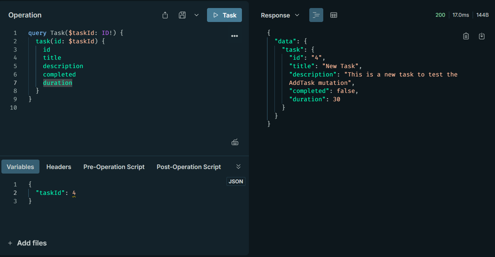

# TP3 : Création d'une API GraphQL avec Node.js et Express
Ce dépôt contient le code et le compte rendu pour le **Travail Pratique 2 (TP2)** du cours **SOA et Microservices**. L'objectif de ce TP est de créer une API GraphQL en utilisant **Node.js**, **Express JS** et **Apollo Server**, tout en apprenant à définir un schéma GraphQL et à implémenter des résolveurs pour gérer les requêtes et les mutations.

---

## Objectifs du TP
- Comprendre comment configurer et utiliser GraphQL avec Node.js et Express
- Créer un schéma GraphQL pour une API simple de gestion de tâches.
- Implémenter des résolveurs pour gérer les requêtes et les mutations.
- Tester l'API GraphQL avec Apollo Sandbox.

--- 

## Outils Utilisés
- **Node.js** : Environnement d'exécution JavaScript.
- **Express JS** : Framework pour la création d'applications web et d'API.
- **Apollo Server** : Serveur GraphQL pour Node.js.
- **GraphQL** : Langage de requête pour les API.
- **Apollo Sandbox** : Interface graphique pour tester les requêtes GraphQL.

---

## Structure du Projet

- **`taskSchema.gql`** : Fichier contenant le schéma GraphQL pour les tâches.
- **`taskSchema.js`** : Fichier qui charge et compile le schéma GraphQL.
- **`taskResolver.js`** : Fichier contenant les résolveurs pour les requêtes et mutations.
- **`index.js`** : Fichier principal de l'API, configurant le serveur Express et Apollo Server.
- **`README.md`** : Ce fichier, contenant les instructions et les informations sur le projet.

---

## Comment Exécuter le Projet

1. Clonez ce dépôt sur votre machine locale :
```bash
https://github.com/MohamedHabibFrigui/SOA/tree/main/TP3
```
 2. Installez les dépendances nécessaires :
 ```bash
 npm install
 ```
 3. Démarrez le serveur :
 ```bash
 node index.js
 ```
 4. Le serveur sera accessible à l'adresse
 ```
 http://localhost:5000/graphql
 ```
 5. Utilisez **Apollo Sandbox** pour tester les requêtes et mutations GraphQL.
 
 ---
 
 ## Schéma GraphQL

 Le schéma GraphQL définit les types de données, les requêtes et les mutations disponibles dans l'API. Voici le schéma utilisé dans ce projet :
 ```graphql
type Task {
    id: ID!
    title: String!
    description: String!
    completed: Boolean!
    duration: Int!
}

type Query {
    task(id: ID!): Task
    tasks: [Task]
}

type Mutation {
    addTask(title: String!, description: String!, completed: Boolean!, duration: Int!): Task
    completeTask(id: ID!): Task
    changeDescription(id: ID!, description: String!): Task
    deleteTask(id: ID!): Task
}
 ```
 
 ---
 
 ## Requêtes et Mutations
 
 ### 1. Récupérer toutes les tâches
 - **Type** : `Query`
 - **Requête ** :
 ```graphql
query {
    tasks {
        id
        title
        description
        completed
        duration
    }
}
 ```
 ### 2. Récupérer une tâche par son ID
 - **Type** : `Query`
 - **Requête ** :
 ```graphql
query {
    task(id: "1") {
        id
        title
        description
        completed
        duration
    }
}
 ```
 ### 3. Ajouter une nouvelle tâche
 - **Type** : `Mutation`
 - **Requête ** :
 ```graphql
mutation {
    addTask(title: "Nouvelle Tâche", description: "Description de la tâche", completed: false, duration: 30) {
        id
        title
        description
        completed
        duration
    }
}
 ```
 ### 4. Marquer une tâche comme terminée
 - **Type** : `Mutation`
 - **Requête ** :
 ```graphql
mutation {
    completeTask(id: "4") {
        id
        title
        completed
    }
}
 ```
 ### 5. Changer la description d'une tâche
 - **Type** : `Mutation`
 - **Requête ** :
 ```graphql
mutation {
    changeDescription(id: "1", description: "Nouvelle description") {
        id
        description
    }
}
 ```
 ### 6. Supprimer une tâche
 - **Type** : `Mutation`
 - **Requête ** :
 ```graphql
mutation {
    deleteTask(id: "1") {
        id
        title
    }
}
 ```
 
 ---
 
## Tests avec Apollo Sandbox

Voici quelques captures d'écran des tests des requêtes et mutations avec Apollo Sandbox :

### 1. Récupérer toutes les tâches


### 2. Récupérer tâche par id


### 3. Ajouter une nouvelle tâche


### 4. Marquer une tâche comme terminée


### 5. Changer la description d'une tâche


### 6. Supprimer une tâche


 ---
 
 ## Auteur
 
 - **Mohamed Habib Frigui**
 - Classe : 4 GL 1
 - Enseignant : Dr. Salah Gontara
 - Matière : SOA et Microservices
