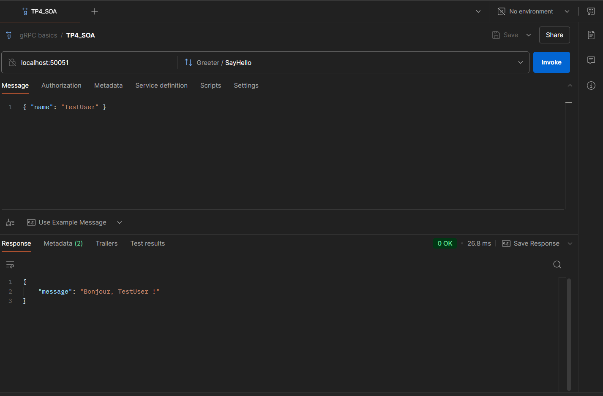

# TP4 : Introduction à gRPC

Ce dépôt contient le code et le compte rendu pour le **Travail Pratique 4 (TP4)** du cours **SOA et Microservices**. L'objectif de ce TP est de créer un service gRPC en utilisant **Node.js**, **Protocol Buffers (protobuf)** et **gRPC**, tout en apprenant à définir un service gRPC et à implémenter un serveur pour gérer les requêtes et les réponses.

---

## Objectifs du TP

- Comprendre comment configurer et utiliser gRPC avec Node.js et Protocol Buffers.
- Créer un service gRPC simple pour gérer des requêtes et des réponses.
- Implémenter un serveur gRPC et tester les requêtes avec Postman.

---

## Outils Utilisés

- **Node.js** : Environnement d'exécution JavaScript.
- **Protocol Buffers (protobuf)** : Format de sérialisation de données structurées.
- **gRPC** : Framework d'appel de procédure à distance (RPC) pour la communication entre services.
- **Postman** : Outil pour tester les requêtes gRPC.

---

## Structure du Projet

- **`hello.proto`** : Fichier contenant la définition du service gRPC et des messages en utilisant Protocol Buffers.
- **`server.js`** : Fichier contenant l'implémentation du serveur gRPC.
- **`README.md`** : Ce fichier, contenant les instructions et les informations sur le projet.

---

## Comment Exécuter le Projet

1. Clonez ce dépôt sur votre machine locale :

```bash
https://github.com/MohamedHabibFrigui/SOA/tree/main/TP4
```

2.  Installez les dépendances nécessaires :

```bash
npm install
```

3.  Démarrez le serveur gRPC :

```bash
node server.js
```

4.  Le serveur sera accessible à l'adresse

```
localhost:50051
```

5.  Utilisez **Postman** pour tester les requêtes gRPC.

---

## Définition du Service gRPC

Le service gRPC est défini dans le fichier **`hello.proto`**. Voici la définition du service et des messages :

```proto
syntax = "proto3";

package hello;

service Greeter {
   rpc SayHello (HelloRequest) returns (HelloReply) {}
}

message HelloRequest {
   string name = 1;
}

message HelloReply {
   string message = 1;
}
```

---

## Requêtes gRPC

### 1. Récupérer toutes les tâches

- **Type** : `Unary RPC`
- **Requête ** :

```json
{
  "name": "TestUser"
}
```

- **Réponse ** :

```json
{
  "message": "Bonjour, TestUser !"
}
```

---

## Tests avec Postman

Voici une capture d'écran du test de la requête avec Postman :

### 1. Récupérer toutes les tâches



---

## Auteur

- **Mohamed Habib Frigui**
- Classe : 4 GL 1
- Enseignant : Dr. Salah Gontara
- Matière : SOA et Microservices
