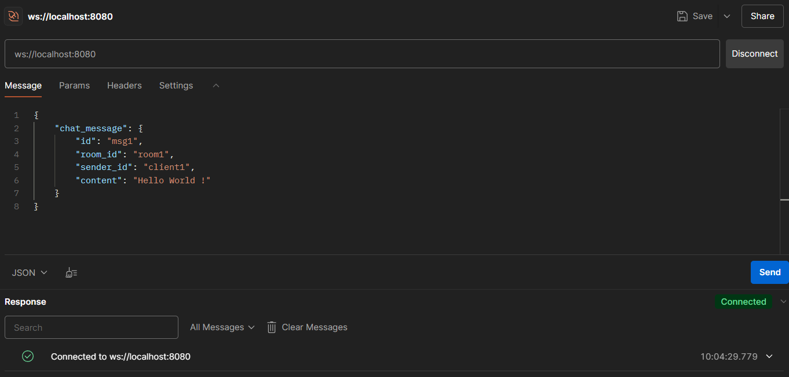
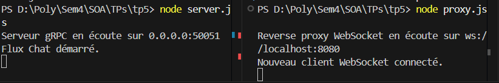

# TP5 : Reverse Proxy WebSocket avec microservice gRPC

Ce dépôt contient le code et le compte rendu pour le **Travail Pratique 5 (TP5)** du cours **SOA et Microservices**. L'objectif de ce TP est de mettre en place un service de chat simplifié en utilisant **gRPC** et un **reverse proxy WebSocket** pour relayer les messages.

---

## Objectifs du TP

- Définir un service gRPC via un fichier **`.proto`**.
- Créer un serveur gRPC en Node.js pour gérer les requêtes et les réponses.
- Mettre en place un reverse proxy WebSocket pour relayer les messages entre les clients et le serveur gRPC.

---

## Outils Utilisés

- **Node.js** : Environnement d'exécution JavaScript.
- **Protocol Buffers (protobuf)** : Format de sérialisation de données structurées.
- **gRPC** : Framework d'appel de procédure à distance (RPC) pour la communication entre services.
- **WebSocket ** : Protocole de communication full-duplex pour des échanges en temps réel.
- **Postman** : Outil pour tester les requêtes gRPC et WebSocket.

---

## Structure du Projet

- **`chat.proto`** : Fichier contenant la définition du service gRPC et des messages en utilisant Protocol Buffers.
- **`server.js`** : Fichier contenant l'implémentation du serveur gRPC.
- **`proxy.js`** : Fichier contenant le reverse proxy WebSocket qui communique avec le serveur gRPC.
- **`client.html`** : Interface Web simple pour interagir avec le serveur WebSocket.
- **`README.md`** : Ce fichier, contenant les instructions et les informations sur le projet.

---

## Comment Exécuter le Projet

1. Clonez ce dépôt sur votre machine locale :

```bash
https://github.com/MohamedHabibFrigui/SOA/tree/main/TP5
```

2.  Installez les dépendances nécessaires :

```bash
npm install
```

3.  Démarrez le serveur gRPC :

```bash
node server.js
```

4.  Démarrez le reverse proxy WebSocket :

```
node proxy.js
```

5.  Le serveur gRPC sera accessible à l'adresse :

```
localhost:50051
```

6.  Le reverse proxy WebSocket sera accessible à l'adresse :

```
ws://localhost:8080
```

7.  Utilisez **Postman** pour tester les requêtes gRPC ou bien ouvrez le fichier **`client.html`** dans un navigateur pour interagir avec le serveur WebSocket.

---

## Définition du Service gRPC

Le service gRPC est défini dans le fichier **`chat.proto`**. Voici la définition du service et des messages :

```proto
syntax = "proto3";

package chat;

// Définition d'une énumération pour représenter le statut d'un utilisateur
enum UserStatus {
    UNKNOWN = 0; // Statut inconnu (valeur par défaut)
    ACTIVE = 1; // Utilisateur actif
    INACTIVE = 2; // Utilisateur inactif
}

// Message représentant un utilisateur
message User {
    string id = 1; // Identifiant unique de l'utilisateur
    string name = 2; // Nom de l'utilisateur
    string email = 3; // Adresse email
    UserStatus status = 4; // Statut de l'utilisateur
}

// Message représentant un message de chat
message ChatMessage {
    string id = 1; // Identifiant du message
    string room_id = 2; // Identifiant de la salle de chat
    string sender_id = 3; // Identifiant de l'expéditeur
    string content = 4; // Contenu du message
}

// Définition du service gRPC
service ChatService {
    rpc GetUser(GetUserRequest) returns (GetUserResponse);
    rpc Chat(stream ChatStream) returns (stream ChatStream);
}

// Message de requête pour récupérer un utilisateur
message GetUserRequest {
    string user_id = 1; // Identifiant de l'utilisateur à récupérer
}

// Message de réponse contenant les informations d'un utilisateur
message GetUserResponse {
    User user = 1; // L'utilisateur correspondant à la requête
}

// Message utilisé pour le streaming de chat
message ChatStream {
    oneof payload {
        ChatMessage chat_message = 1; // Un message de chat
    }
}
```

---

## Requêtes gRPC et WebSocket

### 1. Envoyer un message de chat via WebSocket

- **Type** : `WebSocket`
- **Requête ** :

```json
{
  "chat_message": {
    "id": "msg1",
    "room_id": "room1",
    "sender_id": "client1",
    "content": "Hello World !"
  }
}
```

---

## Tests avec Postman

Voici une capture d'écran du test de la requête avec Postman :

### 1. Envoyer une message de chat via WebSocket




---

## Auteur

- **Mohamed Habib Frigui**
- Classe : 4 GL 1
- Enseignant : Dr. Salah Gontara
- Matière : SOA et Microservices
